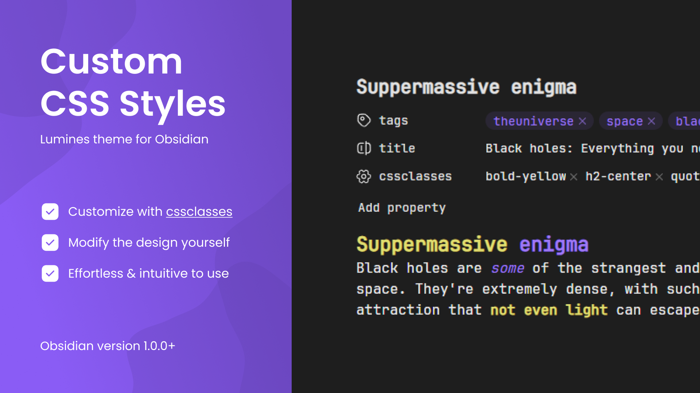
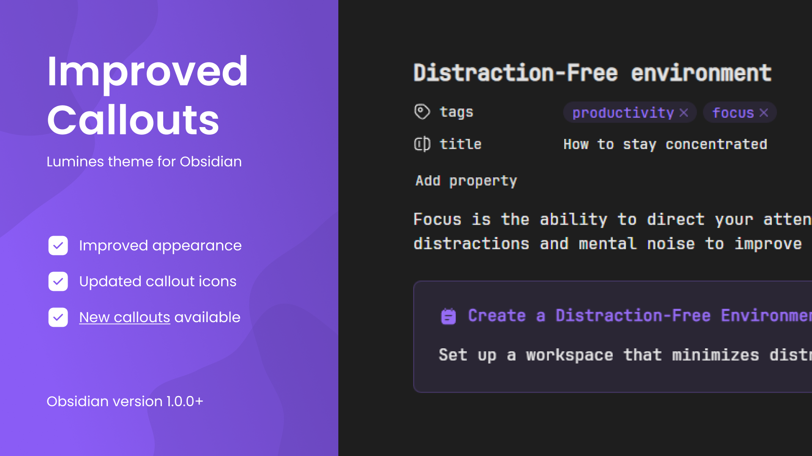
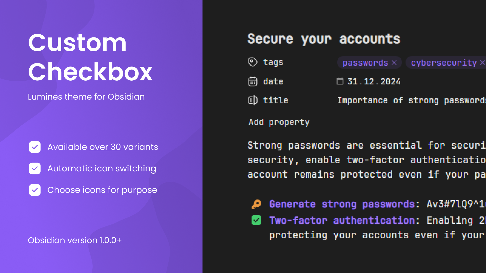

  

    <h1>Obsidian Lumines</h1>
    
Minimal Obsidian theme used daily by thousands of users.

  

  

    <a href="https://github.com/danielkhmara/obsidian-lumines" target="_blank">Star on GitHub</a> ⭐ <a href="https://github.com/danielkhmara/obsidian-lumines/issues" target="_blank">Report an Issue</a>
  

  <h2>About This Theme</h2>
  
  
The theme has been in development since 2024 and has already been widely adopted, with thousands of people using it every day. It preserves the familiar Obsidian interface while offering an updated color palette and an expanded set of features, ensuring a smooth transition from the default theme. Support for Android, Windows, iOS, and macOS allows users to work comfortably on any device.

  
Special attention is given to enhancing Obsidian’s capabilities, improving stability, performance, and compatibility. Issues not detected by developers in new releases are promptly fixed in updates, which also include improvements to newly released features. Thanks to the use of the <a href="https://help.obsidian.md/catalyst" target="_blank">Catalyst license</a> during the theme’s development, users often receive updates even before new public versions of Obsidian are released.

  

    <h2>Features</h2>
  

  

    <h3>Situational Icons</h3>
    
    
The standard Obsidian property types have been unified with stylish icons, and customization options have been expanded. Icons can now change automatically not only depending on the property type, but also according to the keywords listed below. With support for over 300 icons, the Obsidian information management system becomes more functional and visually appealing.

    <h4>Available Values</h4>
    

      
Click to View Available Values

      

        
1. Statuses & Events

        <ul>
          <li>accepted</li>
          <li>analyzed</li>
          <li>assigned</li>
          <li>birthday</li>
          <li>cancelled</li>
          <li>created</li>
          <li>deleted</li>
          <li>duedate</li>
          <li>expired</li>
          <li>exported</li>
          <li>imported</li>
          <li>received</li>
          <li>updated</li>
          <li>year</li>
        </ul>
      

      

        
2. Documents & Business

        <ul>
          <li>book</li>
          <li>bookmark</li>
          <li>bookmarks</li>
          <li>certificate</li>
          <li>checklist</li>
          <li>contract</li>
          <li>gavel</li>
          <li>license</li>
          <li>report</li>
          <li>signature</li>
          <li>ticket</li>
        </ul>
      

      

        
3. Brands & Locations

        <ul>
          <li>airbnb</li>
          <li>alipay</li>
          <li>android</li>
          <li>angular</li>
          <li>apple</li>
          <li>badoo</li>
          <li>bitbucket</li>
          <li>bluesky</li>
          <li>bootstrap</li>
          <li>chrome</li>
          <li>cloudflare</li>
          <li>codepen</li>
          <li>css</li>
          <li>discord</li>
          <li>django</li>
          <li>docker</li>
          <li>dribbble</li>
          <li>edge</li>
          <li>evernote</li>
          <li>facebook</li>
          <li>figma</li>
          <li>firefox</li>
          <li>fiverr</li>
          <li>git</li>
          <li>github</li>
          <li>gitlab</li>
          <li>golang</li>
          <li>html</li>
          <li>instagram</li>
          <li>javascript</li>
          <li>kick</li>
          <li>kotlin</li>
          <li>laravel</li>
          <li>leetcode</li>
          <li>linkedin</li>
          <li>mastodon</li>
          <li>matrix</li>
          <li>mysql</li>
          <li>netflix</li>
          <li>nextcloud</li>
          <li>nextjs</li>
          <li>nodejs</li>
          <li>notion</li>
          <li>onedrive</li>
          <li>onlyfans</li>
          <li>openai</li>
          <li>opera</li>
          <li>patreon</li>
          <li>paypal</li>
          <li>php</li>
          <li>pinterest</li>
          <li>powershell</li>
          <li>python</li>
          <li>react</li>
          <li>reddit</li>
          <li>redux</li>
          <li>revolut</li>
          <li>safari</li>
          <li>sass</li>
          <li>sentry</li>
          <li>shopee</li>
          <li>sketch</li>
          <li>slack</li>
          <li>snapchat</li>
          <li>soundcloud</li>
          <li>spotify</li>
          <li>steam</li>
          <li>svelte</li>
          <li>tailwind</li>
          <li>teams</li>
          <li>telegram</li>
          <li>threads</li>
          <li>tiktok</li>
          <li>tinder</li>
          <li>twitch</li>
          <li>twitter</li>
          <li>typescript</li>
          <li>vercel</li>
          <li>vite</li>
          <li>vk</li>
          <li>vscode</li>
          <li>wechat</li>
          <li>whatsapp</li>
          <li>x</li>
          <li>xbox</li>
          <li>youtube</li>
          <li>zoom</li>
          <li>address</li>
          <li>airport</li>
          <li>arch</li>
          <li>bank</li>
          <li>bridge</li>
          <li>capital</li>
          <li>carousel</li>
          <li>castle</li>
          <li>church</li>
          <li>circus</li>
          <li>cottage</li>
          <li>country</li>
          <li>factory</li>
          <li>fortress</li>
          <li>hospital</li>
          <li>lighthouse</li>
          <li>monument</li>
          <li>mosque</li>
          <li>pavilion</li>
          <li>skyscraper</li>
          <li>stadium</li>
          <li>store</li>
          <li>tunnel</li>
          <li>warehouse</li>
        </ul>
      

      

        
4. Electronics & Devices

        <ul>
          <li>airpods</li>
          <li>bluetooth</li>
          <li>calculator</li>
          <li>camera</li>
          <li>cctv</li>
          <li>clock</li>
          <li>cloud</li>
          <li>database</li>
          <li>desktop</li>
          <li>drone</li>
          <li>gamepad</li>
          <li>headphones</li>
          <li>laptop</li>
          <li>microphone</li>
          <li>mobile</li>
          <li>nintendo</li>
          <li>phone</li>
          <li>polaroid</li>
          <li>printer</li>
          <li>projector</li>
          <li>qrcode</li>
          <li>radar</li>
          <li>radio</li>
          <li>robot</li>
          <li>satellite</li>
          <li>shareplay</li>
          <li>slideshow</li>
          <li>speaker</li>
          <li>speakerphone</li>
          <li>stopwatch</li>
          <li>tablet</li>
          <li>tv</li>
          <li>usb</li>
          <li>watch</li>
          <li>wifi</li>
        </ul>
      

      

        
5. Sports & Nature

        <ul>
          <li>baseball</li>
          <li>basketball</li>
          <li>bowling</li>
          <li>cricket</li>
          <li>football</li>
          <li>tennis</li>
          <li>volleyball</li>
          <li>atom</li>
          <li>bolt</li>
          <li>diamond</li>
          <li>eye</li>
          <li>feather</li>
          <li>flare</li>
          <li>heart</li>
          <li>heartbeat</li>
          <li>leaf</li>
          <li>pig</li>
          <li>planet</li>
          <li>plant</li>
          <li>radioactive</li>
          <li>seedling</li>
          <li>skull</li>
          <li>sparkles</li>
          <li>star</li>
          <li>temperature</li>
        </ul>
      

      

        
6. Communication & Media

        <ul>
          <li>author</li>
          <li>cast</li>
          <li>dislike</li>
          <li>like</li>
          <li>mail</li>
          <li>message</li>
          <li>movie</li>
          <li>news</li>
          <li>subject</li>
          <li>teacher</li>
        </ul>
      

      

        
7. Objects & Vehicles

        <ul>
          <li>alarm</li>
          <li>ballpen</li>
          <li>bell</li>
          <li>bible</li>
          <li>cake</li>
          <li>clipboard</li>
          <li>coffin</li>
          <li>directions</li>
          <li>gift</li>
          <li>grave</li>
          <li>key</li>
          <li>map</li>
          <li>palette</li>
          <li>paperclip</li>
          <li>passport</li>
          <li>pencil</li>
          <li>propeller</li>
          <li>puzzle</li>
          <li>sandbox</li>
          <li>scale</li>
          <li>scoreboard</li>
          <li>shield</li>
          <li>sticker</li>
          <li>sword</li>
          <li>swords</li>
          <li>wand</li>
          <li>weight</li>
          <li>ambulance</li>
          <li>backhoe</li>
          <li>bike</li>
          <li>bulldozer</li>
          <li>bus</li>
          <li>camper</li>
          <li>car</li>
          <li>caravan</li>
          <li>crane</li>
          <li>plane</li>
          <li>rocket</li>
          <li>ship</li>
          <li>sleigh</li>
          <li>tir</li>
          <li>tractor</li>
          <li>zeppelin</li>
        </ul>
      

      

        
8. Currencies & Finance

        <ul>
          <li>afghani</li>
          <li>bahraini</li>
          <li>baht</li>
          <li>bitcoin</li>
          <li>cent</li>
          <li>dinar</li>
          <li>dirham</li>
          <li>dollar</li>
          <li>dong</li>
          <li>dram</li>
          <li>euro</li>
          <li>frank</li>
          <li>guarani</li>
          <li>lari</li>
          <li>lira</li>
          <li>paanga</li>
          <li>peso</li>
          <li>pound</li>
          <li>ruble</li>
          <li>rupee</li>
          <li>shekel</li>
          <li>som</li>
          <li>taka</li>
          <li>tenge</li>
          <li>tugrik</li>
          <li>won</li>
          <li>yen</li>
          <li>yuan</li>
          <li>banknote</li>
          <li>cash</li>
          <li>coins</li>
          <li>currency</li>
          <li>invoice</li>
          <li>moneybag</li>
          <li>receipt</li>
          <li>wallet</li>
        </ul>
      

      

        
9. Interface & Tools

        <ul>
          <li>accessible</li>
          <li>archive</li>
          <li>category</li>
          <li>download</li>
          <li>edit</li>
          <li>eraser</li>
          <li>favicon</li>
          <li>file</li>
          <li>files</li>
          <li>filter</li>
          <li>folder</li>
          <li>folders</li>
          <li>graph</li>
          <li>h1</li>
          <li>h2</li>
          <li>h3</li>
          <li>h4</li>
          <li>h5</li>
          <li>h6</li>
          <li>hash</li>
          <li>history</li>
          <li>icons</li>
          <li>image</li>
          <li>inbox</li>
          <li>label</li>
          <li>link</li>
          <li>notification</li>
          <li>plot</li>
          <li>priority</li>
          <li>references</li>
          <li>reload</li>
          <li>reorder</li>
          <li>repeat</li>
          <li>rotate</li>
          <li>runtime</li>
          <li>settings</li>
          <li>share</li>
          <li>source</li>
          <li>status</li>
          <li>summary</li>
          <li>tracked</li>
          <li>trash</li>
          <li>wallpaper</li>
        </ul>
      

    

  

  

    <h3>Customization With CSS</h3>
    
    
It is enough to create the property “cssclasses” and assign one or more values to change the appearance of a note. For example, using the value `italic-yellow` will display all italic text in yellow. This feature allows not only changing text color, but also adjusting the position of headings and applying various other styles.

    <h4>Available Values</h4>
    

      
Click to View Available Values

      

        
1. Heading align

        

          
Center

          <ul>
            <li>h1-center</li>
            <li>h2-center</li>
            <li>h3-center</li>
            <li>h4-center</li>
            <li>h5-center</li>
            <li>h6-center</li>
          </ul>
        

        

          
End

          <ul>
            <li>h1-end</li>
            <li>h2-end</li>
            <li>h3-end</li>
            <li>h4-end</li>
            <li>h5-end</li>
            <li>h6-end</li>
          </ul>
        

      

      

        
2. Heading color

        

          
h1

          <ul>
            <li>h1-red</li>
            <li>h1-orange</li>
            <li>h1-yellow</li>
            <li>h1-lime</li>
            <li>h1-green</li>
            <li>h1-cyan</li>
            <li>h1-sky</li>
            <li>h1-blue</li>
            <li>h1-indigo</li>
            <li>h1-violet</li>
            <li>h1-pink</li>
            <li>h1-gray</li>
            <li>h1-white</li>
          </ul>
        

        

          
h2

          <ul>
            <li>h2-red</li>
            <li>h2-orange</li>
            <li>h2-yellow</li>
            <li>h2-lime</li>
            <li>h2-green</li>
            <li>h2-cyan</li>
            <li>h2-sky</li>
            <li>h2-blue</li>
            <li>h2-indigo</li>
            <li>h2-violet</li>
            <li>h2-pink</li>
            <li>h2-gray</li>
            <li>h2-white</li>
          </ul>
        

        

          
h3

          <ul>
            <li>h3-red</li>
            <li>h3-orange</li>
            <li>h3-yellow</li>
            <li>h3-lime</li>
            <li>h3-green</li>
            <li>h3-cyan</li>
            <li>h3-sky</li>
            <li>h3-blue</li>
            <li>h3-indigo</li>
            <li>h3-violet</li>
            <li>h3-pink</li>
            <li>h3-gray</li>
            <li>h3-white</li>
          </ul>
        

        

          
h4

          <ul>
            <li>h4-red</li>
            <li>h4-orange</li>
            <li>h4-yellow</li>
            <li>h4-lime</li>
            <li>h4-green</li>
            <li>h4-cyan</li>
            <li>h4-sky</li>
            <li>h4-blue</li>
            <li>h4-indigo</li>
            <li>h4-violet</li>
            <li>h4-pink</li>
            <li>h4-gray</li>
            <li>h4-white</li>
          </ul>
        

        

          
h5

          <ul>
            <li>h5-red</li>
            <li>h5-orange</li>
            <li>h5-yellow</li>
            <li>h5-lime</li>
            <li>h5-green</li>
            <li>h5-cyan</li>
            <li>h5-sky</li>
            <li>h5-blue</li>
            <li>h5-indigo</li>
            <li>h5-violet</li>
            <li>h5-pink</li>
            <li>h5-gray</li>
            <li>h5-white</li>
          </ul>
        

        

          
h6

          <ul>
            <li>h6-red</li>
            <li>h6-orange</li>
            <li>h6-yellow</li>
            <li>h6-lime</li>
            <li>h6-green</li>
            <li>h6-cyan</li>
            <li>h6-sky</li>
            <li>h6-blue</li>
            <li>h6-indigo</li>
            <li>h6-violet</li>
            <li>h6-pink</li>
            <li>h6-gray</li>
            <li>h6-white</li>
          </ul>
        

      

      

        
3. Bold color

        <ul>
          <li>bold-red</li>
          <li>bold-orange</li>
          <li>bold-yellow</li>
          <li>bold-lime</li>
          <li>bold-green</li>
          <li>bold-cyan</li>
          <li>bold-sky</li>
          <li>bold-blue</li>
          <li>bold-indigo</li>
          <li>bold-violet</li>
          <li>bold-pink</li>
          <li>bold-gray</li>
          <li>bold-white</li>
        </ul>
      

      

        
4. Italic color

        <ul>
          <li>italic-red</li>
          <li>italic-orange</li>
          <li>italic-yellow</li>
          <li>italic-lime</li>
          <li>italic-green</li>
          <li>italic-cyan</li>
          <li>italic-sky</li>
          <li>italic-blue</li>
          <li>italic-indigo</li>
          <li>italic-violet</li>
          <li>italic-pink</li>
          <li>italic-gray</li>
          <li>italic-white</li>
        </ul>
      

      

        
5. Quote color

        <ul>
          <li>quote-red</li>
          <li>quote-orange</li>
          <li>quote-yellow</li>
          <li>quote-lime</li>
          <li>quote-green</li>
          <li>quote-cyan</li>
          <li>quote-sky</li>
          <li>quote-blue</li>
          <li>quote-indigo</li>
          <li>quote-violet</li>
          <li>quote-pink</li>
          <li>quote-gray</li>
          <li>quote-white</li>
        </ul>
      

    

  

  

    <h3>Enhanced Callouts</h3>
    
    
Callouts have been updated: visual issues have been fixed, the appearance has been refreshed, and new icons and values have been added. Simply select a value from the list below for the callout to automatically update its color and icon.

    <h4>Available Values</h4>
    

      
Click to View Available Values

      <ul>
        <li>> [!file] Callout</li>
        <li>> [!linkedin] Callout</li>
        <li>> [!pig] Callout</li>
        <li>> [!steam] Callout</li>
        <li>> [!youtube] Callout</li>
        <li>> [!shield] Callout</li>
        <li>> [!balloon] Callout</li>
        <li>> [!dollar] Callout</li>
        <li>> [!folder] Callout</li>
        <li>> [!flare] Callout</li>
        <li>> [!mobile] Callout</li>
        <li>> [!location] Callout</li>
        <li>> [!cloud] Callout</li>
        <li>> [!like] Callout</li>
        <li>> [!dislike] Callout</li>
        <li>> [!github] Callout</li>
        <li>> [!tiktok] Callout</li>
        <li>> [!clock] Callout</li>
        <li>> [!cannabis] Callout</li>
        <li>> [!star] Callout</li>
        <li>> [!settings] Callout</li>
        <li>> [!truck] Callout</li>
        <li>> [!diamond] Callout</li>
        <li>> [!palette] Callout</li>
        <li>> [!bell] Callout</li>
        <li>> [!yuan] Callout</li>
        <li>> [!up] Callout</li>
        <li>> [!down] Callout</li>
        <li>> [!euro] Callout</li>
        <li>> [!message] Callout</li>
        <li>> [!code] Callout</li>
        <li>> [!trophy] Callout</li>
        <li>> [!windmill] Callout</li>
        <li>> [!unknown] Callout</li>
        <li>> [!card] Callout</li>
        <li>> [!tablet] Callout</li>
        <li>> [!bitcoin] Callout</li>
        <li>> [!whatsapp] Callout</li>
        <li>> [!mail] Callout</li>
        <li>> [!rupee] Callout</li>
        <li>> [!desktop] Callout</li>
        <li>> [!archive] Callout</li>
        <li>> [!accessible] Callout</li>
        <li>> [!taka] Callout</li>
        <li>> [!heart] Callout</li>
        <li>> [!filter] Callout</li>
        <li>> [!pound] Callout</li>
        <li>> [!discord] Callout</li>
        <li>> [!yen] Callout</li>
        <li>> [!badge] Callout</li>
        <li>> [!badges] Callout</li>
        <li>> [!bandage] Callout</li>
        <li>> [!briefcase] Callout</li>
        <li>> [!bubble] Callout</li>
        <li>> [!image] Callout</li>
        <li>> [!cookie] Callout</li>
        <li>> [!diamonds] Callout</li>
        <li>> [!eye] Callout</li>
        <li>> [!flower] Callout</li>
        <li>> [!ghost] Callout</li>
        <li>> [!gift] Callout</li>
        <li>> [!hourglass] Callout</li>
        <li>> [!key] Callout</li>
        <li>> [!label] Callout</li>
        <li>> [!puzzle] Callout</li>
        <li>> [!radar] Callout</li>
        <li>> [!table] Callout</li>
        <li>> [!trash] Callout</li>
        <li>> [!user] Callout</li>
        <li>> [!award] Callout</li>
        <li>> [!spade] Callout</li>
        <li>> [!flame] Callout</li>
        <li>> [!lemon] Callout</li>
        <li>> [!favicon] Callout</li>
        <li>> [!clipboard] Callout</li>
      </ul>
    

  

  

    <h3>Alternative Checkboxes</h3>
    
    
Checkboxes now support more states, not just the standard three. A checkbox uses the syntax `- [x] Checkbox`, where changing the value inside the brackets updates its state. This expands the ways checkboxes can be used and improves the visual organization of notes.

    <h4>Available Values</h4>
    

      
Click to View Available Values

      <ul>
        <li>- [+] Plus</li>
        <li>- [-] Minus</li>
        <li>- [!] Exclamation</li>
        <li>- [?] Question</li>
        <li>- [i] In progress</li>
        <li>- [U] Up</li>
        <li>- [D] Down</li>
        <li>- [L] Left</li>
        <li>- [R] Right</li>
        <li>- [0] Digit 0</li>
        <li>- [1] Digit 1</li>
        <li>- [2] Digit 2</li>
        <li>- [3] Digit 3</li>
        <li>- [4] Digit 4</li>
        <li>- [5] Digit 5</li>
        <li>- [6] Digit 6</li>
        <li>- [7] Digit 7</li>
        <li>- [8] Digit 8</li>
        <li>- [9] Digit 9</li>
        <li>- [a] Alarm</li>
        <li>- [u] User</li>
        <li>- [t] Thumbs Up</li>
        <li>- [T] Thumbs Down</li>
        <li>- [S] Shield</li>
        <li>- [p] Pin</li>
        <li>- [P] Pill</li>
        <li>- [m] Mail</li>
        <li>- [M] Message</li>
        <li>- [l] Label</li>
        <li>- [K] Keyframe</li>
        <li>- [k] Key</li>
        <li>- [H] Home</li>
        <li>- [h] Heart</li>
        <li>- [G] Geolocation</li>
        <li>- [g] Gift</li>
        <li>- [F] Flare</li>
        <li>- [f] Fire</li>
        <li>- [B] Bell</li>
        <li>- [A] Advertisement</li>
        <li>- [C] Confetti</li>
        <li>- [c] Clock</li>
        <li>- [s] Star</li>
        <li>- [I] Idea</li>
        <li>- [b] Bookmark</li>
      </ul>
    

  

  <h2>How to Install Lumines</h2>
  <ol>
    <li>In Obsidian, select <strong>Settings</strong> using the sidebar cog icon.</li>
    <li>Go to <strong>Appearance</strong> and click <strong>Manage</strong> in the Themes section.</li>
    <li>Search for “<strong>Lumines</strong>” and select the theme from the list.</li>
    <li>Click <strong>Install and Use</strong> and wait for the theme to install.</li>
  </ol>
  

    
If issues arise, check the <a href="https://help.obsidian.md/themes" target="_blank">official Obsidian documentation</a>.

  

  <h2>Suggestions and Issues</h2>
  
For suggestions or issues, open a <a href="https://github.com/danielkhmara/obsidian-lumines/pulls" target="_blank">pull request</a> or an <a href="https://github.com/danielkhmara/obsidian-lumines/issues" target="_blank">issue</a>.

