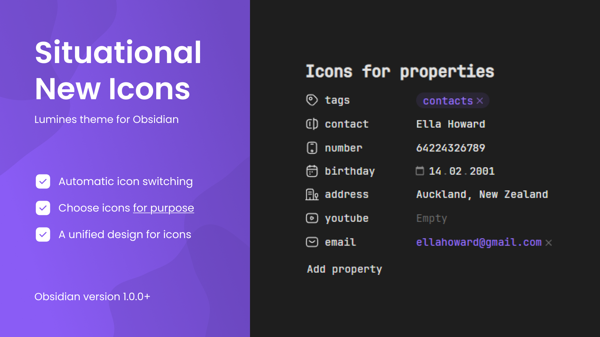

  <h1>Obsidian Lumines</h1>

  <a href="https://github.com/danielkhmara/obsidian-lumines">Star Me on GitHub</a> ⭐ <a href="https://github.com/danielkhmara/obsidian-lumines/issues">Suggest a Feature</a>

 

  
  
Lumines brings a fresh and minimalist design to Obsidian, enhancing the interface without sacrificing functionality. It enhances usability and visual clarity, offering a distraction-free environment that makes note-taking more enjoyable.

  <h2>Situational Icons</h2>
  

    
    
Icons automatically adjust based on property types like text, lists, numbers, and dates, maintaining a unified visual style.

  

  <h2>Situational Icons</h2>
  

    
    
Select from over 40 icons to assign to property names, streamlining the process of distinguishing content in your vault.

  

  

    

      
Property icons

      <ul>
        <li>time</li>
        <li>birthday</li>
        <li>phone</li>
        <li>city</li>
        <li>address</li>
        <li>passport</li>
        <li>bankcard</li>
        <li>socials</li>
        <li>email</li>
        <li>purpose</li>
        <li>source</li>
        <li>cover</li>
        <li>author</li>
        <li>rating</li>
        <li>year</li>
        <li>url</li>
        <li>subject</li>
        <li>save</li>
        <li>heart</li>
        <li>camera</li>
        <li>radio</li>
        <li>music</li>
        <li>money</li>
        <li>note</li>
        <li>game</li>
        <li>weight</li>
        <li>ticket</li>
        <li>timer</li>
        <li>work</li>
        <li>award</li>
        <li>book</li>
        <li>place</li>
        <li>map</li>
        <li>bag</li>
        <li>box</li>
        <li>reserve</li>
        <li>key</li>
        <li>youtube</li>
      </ul>
    

  

  <h2>Custom CSS Styles</h2>
  

    
    
Effortlessly customize the appearance of your notes by applying CSS classes to properties, making personalization seamless.

  

  

    <h3>List of values</h3>
    

      
Heading align

      <ul>
        <li>h1-center</li>
        <li>h2-center</li>
        <li>h3-center</li>
        <li>h4-center</li>
        <li>h5-center</li>
        <li>h6-center</li>
        <li>h1-end</li>
        <li>h2-end</li>
        <li>h3-end</li>
        <li>h4-end</li>
        <li>h5-end</li>
        <li>h6-end</li>
      </ul>
    

    

      
Heading color

      <ul>
        <li>h1-red</li>
        <li>h2-red</li>
        <li>h3-red</li>
        <li>h4-red</li>
        <li>h5-red</li>
        <li>h6-red</li>
        <li>h1-orange</li>
        <li>h2-orange</li>
        <li>h3-orange</li>
        <li>h4-orange</li>
        <li>h5-orange</li>
        <li>h6-orange</li>
        <li>h1-yellow</li>
        <li>h2-yellow</li>
        <li>h3-yellow</li>
        <li>h4-yellow</li>
        <li>h5-yellow</li>
        <li>h6-yellow</li>
        <li>h1-lime</li>
        <li>h2-lime</li>
        <li>h3-lime</li>
        <li>h4-lime</li>
        <li>h5-lime</li>
        <li>h6-lime</li>
        <li>h1-green</li>
        <li>h2-green</li>
        <li>h3-green</li>
        <li>h4-green</li>
        <li>h5-green</li>
        <li>h6-green</li>
        <li>h1-cyan</li>
        <li>h2-cyan</li>
        <li>h3-cyan</li>
        <li>h4-cyan</li>
        <li>h5-cyan</li>
        <li>h6-cyan</li>
        <li>h1-sky</li>
        <li>h2-sky</li>
        <li>h3-sky</li>
        <li>h4-sky</li>
        <li>h5-sky</li>
        <li>h6-sky</li>
        <li>h1-blue</li>
        <li>h2-blue</li>
        <li>h3-blue</li>
        <li>h4-blue</li>
        <li>h5-blue</li>
        <li>h6-blue</li>
        <li>h1-indigo</li>
        <li>h2-indigo</li>
        <li>h3-indigo</li>
        <li>h4-indigo</li>
        <li>h5-indigo</li>
        <li>h6-indigo</li>
        <li>h1-violet</li>
        <li>h2-violet</li>
        <li>h3-violet</li>
        <li>h4-violet</li>
        <li>h5-violet</li>
        <li>h6-violet</li>
        <li>h1-pink</li>
        <li>h2-pink</li>
        <li>h3-pink</li>
        <li>h4-pink</li>
        <li>h5-pink</li>
        <li>h6-pink</li>
        <li>h1-gray</li>
        <li>h2-gray</li>
        <li>h3-gray</li>
        <li>h4-gray</li>
        <li>h5-gray</li>
        <li>h6-gray</li>
        <li>h1-white</li>
        <li>h2-white</li>
        <li>h3-white</li>
        <li>h4-white</li>
        <li>h5-white</li>
        <li>h6-white</li>
      </ul>
    

    

      
Bold color

      <ul>
        <li>bold-red</li>
        <li>bold-orange</li>
        <li>bold-yellow</li>
        <li>bold-lime</li>
        <li>bold-green</li>
        <li>bold-cyan</li>
        <li>bold-sky</li>
        <li>bold-blue</li>
        <li>bold-indigo</li>
        <li>bold-violet</li>
        <li>bold-pink</li>
        <li>bold-gray</li>
        <li>bold-white</li>
      </ul>
    

    

      
Italic color

      <ul>
        <li>italic-red</li>
        <li>italic-orange</li>
        <li>italic-yellow</li>
        <li>italic-lime</li>
        <li>italic-green</li>
        <li>italic-cyan</li>
        <li>italic-sky</li>
        <li>italic-blue</li>
        <li>italic-indigo</li>
        <li>italic-violet</li>
        <li>italic-pink</li>
        <li>italic-gray</li>
        <li>italic-white</li>
      </ul>
    

    

      
Quote color

      <ul>
        <li>quote-red</li>
        <li>quote-orange</li>
        <li>quote-yellow</li>
        <li>quote-lime</li>
        <li>quote-green</li>
        <li>quote-cyan</li>
        <li>quote-sky</li>
        <li>quote-blue</li>
        <li>quote-indigo</li>
        <li>quote-violet</li>
        <li>quote-pink</li>
        <li>quote-gray</li>
        <li>quote-white</li>
      </ul>
    

  

  <h2>Improved Callouts</h2>
  

    
    
All callout icons have been refreshed, visual discrepancies have been corrected, and new callout types are also available.

  

  

    

      
New callouts

      <ul>
        <li>>[!like] Callout</li>
        <li>>[!dislike] Callout</li>
        <li>>[!star] Callout</li>
        <li>>[!image] Callout</li>
        <li>>[!sort] Callout</li>
      </ul>
    

  <h2>Custom Checkboxes</h2>
  

    
    
Customize checkboxes by replacing the default symbol with any other character, giving you more control over your tasks.

  

  

    

      
New checkboxes

      <ul>
        <li>[c] – Checkmark</li>
        <li>[C] – Cross</li>
        <li>[+] – Plus</li>
        <li>[-] – Minus</li>
        <li>[!] – Exclamation</li>
        <li>[?] – Question</li>
        <li>[s] – Search</li>
        <li>[o] – Circle</li>
        <li>[U] – Up</li>
        <li>[D] – Down</li>
        <li>[l] – Like</li>
        <li>[d] – Dislike</li>
        <li>[*] – Star</li>
        <li>[h] – Heart</li>
        <li>[S] – Shield</li>
        <li>[k] – Key</li>
        <li>[I] – Idea</li>
        <li>[A] – Alert</li>
        <li>[$] – Dollar</li>
        <li>[i] – In progress</li>
        <li>[p] – Play</li>
        <li>[P] – Pause</li>
        <li>[R] – Repeat</li>
        <li>[L] – Location</li>
        <li>[u] – Undo</li>
        <li>[r] – Redo</li>
        <li>[>] – Calendar</li>
        <li>[=] – Calculator</li>
        <li>[t] – Text</li>
        <li>[T] – Translate</li>
        <li>[q] – Quote</li>
      </ul>
    

  

    <h2>How do I install Lumines?</h2>
    <ol>
      <li>Go to your vault <strong>Settings</strong> in Obsidian app.</li>
      <li>Click on <strong>Appearance</strong> in the left-hand menu.</li>
      <li>Scroll to Themes section and click <strong>Manage</strong>.</li>
      <li>Enter "<strong>Lumines</strong>" in the search and <strong>Install</strong>.</li>
    </ol>
  

  

    
Can't install? Learn more about it in the official <a href="https://help.obsidian.md/themes">Obsidian guide</a>.

  

  <h2>For suggestions or issues</h2>
  
For suggestions or issues, open an <a href="https://github.com/danielkhmara/obsidian-lumines/issues">issue</a> or submit a <a href="https://github.com/danielkhmara/obsidian-lumines/pulls">pull request</a>.

